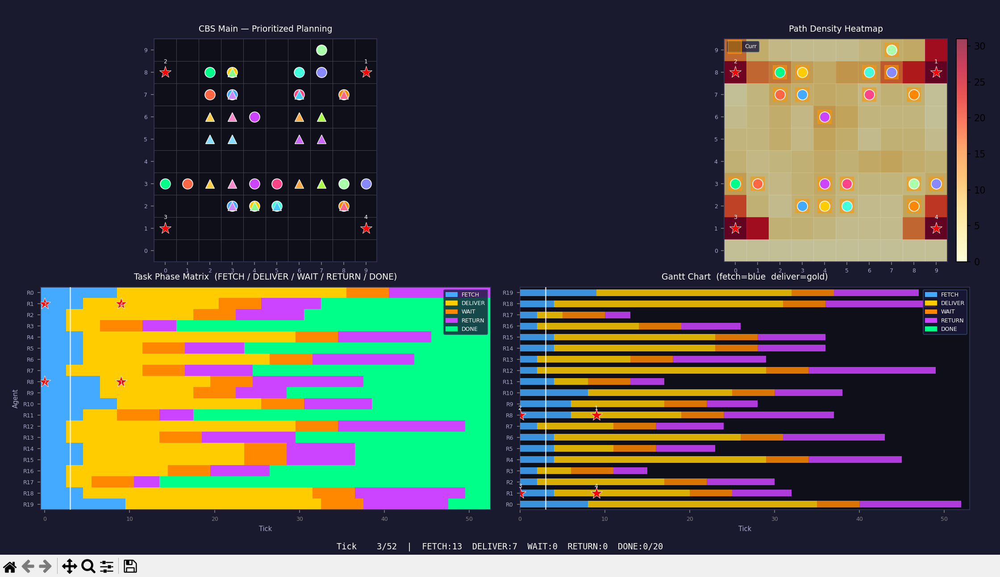
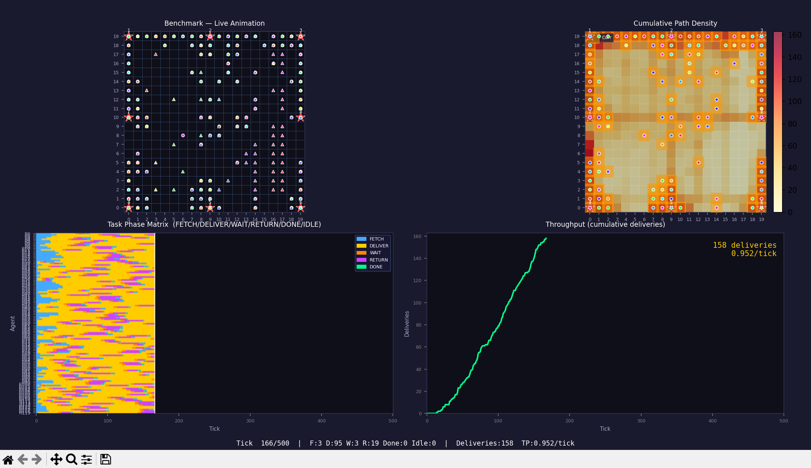
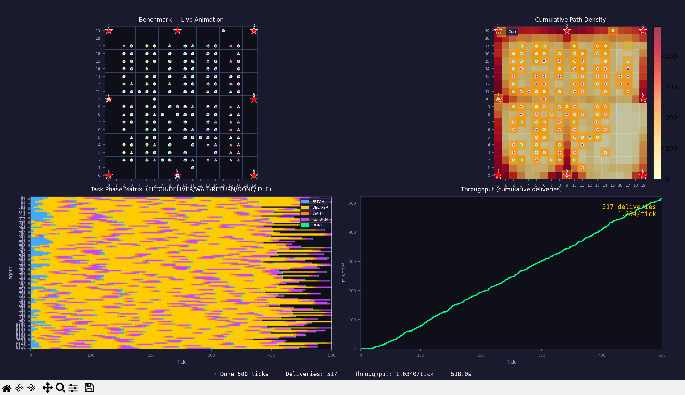

# CBS_sim — 基于 CBS 的多机器人仓储路径规划仿真

基于 **Prioritized Planning(PP)** 的多机器人路径规划 (MAPF) 仿真系统，模拟仓储场景中机器人取货—送货—等待—回返的完整搬运周期。

## 仿真场景

在 N×N 网格仓库中，多台机器人执行 Pod 搬运任务：

```
FETCH → DELIVER → WAIT (5 ticks) → RETURN → DONE
```

每个任务周期：
1. **FETCH** — 机器人前往 Pod 所在位置取货
2. **DELIVER** — 携带 Pod 移动到目标工作站
3. **WAIT** — 在工作站等待处理（5 ticks）
4. **RETURN** — 将 Pod 送回原始位置
5. **DONE** — 任务完成

## 地图配置

支持两种地图尺寸，通过 JSON 配置文件定义：

| 配置 | 网格 | 工作站 | 机器人 | Pod 数 | 配置文件 |
|------|------|--------|--------|--------|----------|
| 10×10 | 10×10 | 4 | 30 | 42 | `map_config_10x10.json` |
| 20×20 | 20×20 | 8 | 120 | 165 | `map_config_20x20.json` |

### JSON 配置格式
有限ticks模式使用
```json
{
    "map_size": 10,
    "num_robots": 30,
    "stations": [{"tar_id": 1, "row": 1, "col": 9}, ...],
    "robot_starts": [[0, 0], [0, 1], ...],
    "pod_tasks": [{"row": 1, "col": 1, "station_id": 1}, ...]
}
```

支持两种 Pod 定义方式：
- **`pod_tasks`**：显式列表，每个 Pod 指定位置和目标工作站
- **`pod_blocks`**：块定义，自动展开并 round-robin 分配工作站

机器人位置可省略 `robot_starts`，系统自动在空闲格子上放置。

## 项目结构
one-shot模式使用main.py
有限ticks模式使用bench_finite.py
```
CBS_sim/
├── main.py                 # 主入口：CBS/PP 规划 + 可视化动画
├── bench_finite.py         # 有限 tick 吞吐量基准测试（连续循环）
├── world.py                # 世界定义：地图配置 + Agent/Task 构建
├── cbs.py                  # CBS 高层规划器（含 Bypass 优化）
├── prioritized_planning.py # 优先级规划（PP，CBS 的快速替代）
├── low_level.py            # Space-Time A* 低层路径搜索
├── task_assign.py          # 匈牙利算法任务分配
├── cbs_types.py            # 基础类型：Agent, Task, Constraint, Conflict
├── map_config_10x10.json   # 10×10 地图配置
└── map_config_20x20.json   # 20×20 地图配置
```

## 模块说明

### 路径规划

| 模块 | 算法 | 说明 |
|------|------|------|
| `cbs.py` | Conflict-Based Search | 最优 MAPF 算法，搜索空间 O(2^冲突数)，适合小规模 |
| `prioritized_planning.py` | Prioritized Planning | 按优先级逐一规划，速度快，适合大规模场景 |
| `low_level.py` | Space-Time A* | 底层路径搜索，支持顶点/边约束 |

### 任务分配

`task_assign.py` 使用匈牙利算法（`scipy.optimize.linear_sum_assignment`）求解最小代价匹配，代价 = 机器人到 Pod 的曼哈顿距离。无 scipy 时自动降级为贪心分配。

### 数据类型 (`cbs_types.py`)

- **`Agent`** — 机器人：起点、任务、路径、各阶段时间索引
- **`Task`** — 搬运任务：Pod 位置 → 工作站位置
- **`Constraint`** — 时空约束：顶点约束 / 边约束
- **`Conflict`** — 冲突检测结果：顶点冲突 / 边冲突

## 使用方法

### 1. One-Shot 仿真 (`main.py`)

一次性规划所有路径，然后回放动画：

```bash
python main.py
```

通过修改 `SCENARIO` 切换配置：
```python
SCENARIO = 10   # 10 robots / 10 pods
SCENARIO = 20   # 20 robots / 20 pods
SCENARIO = 42   # 42 robots / 42 pods
```

**可视化四面板（2×2 布局）：**

| 位置 | 面板 | 说明 |
|------|------|------|
| 左上 | **主动画** | 实时显示机器人（●）和 Pod（▲）在网格上的移动。工作站标记为红色★。每个机器人/Pod 有独立颜色，Pod 在 FETCH 阶段静止于原位，DELIVER/WAIT/RETURN 阶段跟随机器人移动，DONE 后回到原位 |
| 右上 | **路径密度热力图** | 所有规划路径叠加的热力图（YlOrRd 色阶），显示各格子被经过的频率。橙色方块标记当前机器人所在位置。用于识别交通热点和走廊瓶颈 |
| 左下 | **任务阶段矩阵** | Agent × Tick 的颜色矩阵。蓝色=FETCH，金色=DELIVER，橙色=WAIT，紫色=RETURN，绿色=DONE。白色竖线标记当前 tick。直观展示各机器人的任务进度和时间分布 |
| 右下 | **甘特图** | 每个 Agent 的四段任务时间线（水平条形图），颜色与阶段矩阵一致。用于对比各机器人的任务耗时差异和调度效率 |

### 2. 吞吐量基准测试 (`bench_finite.py`)

连续运行指定 tick 数，机器人循环执行任务，Pod 完成后冷却 2 tick 再重新分配：

```bash
python bench_finite.py 500
```

通过修改 `MAP_SIZE` 切换地图：
```python
MAP_SIZE = 10   # 10×10: 42 pods / 30 robots / 4 stations
MAP_SIZE = 20   # 20×20: 165 pods / 120 robots / 8 stations
```

设置 `VISUALIZE = True` 开启实时可视化。

**可视化四面板（2×2 布局）：**

| 位置 | 面板 | 说明 |
|------|------|------|
| 左上 | **主动画** | 实时显示机器人（●）和 Pod（▲）在网格上的移动。全部 Pod 持续显示（包括未分配和冷却中的），冷却中的 Pod 显示为灰色。工作站标记为红色★ |
| 右上 | **累积路径密度** | 随仿真推进不断累积的热力图（YlOrRd 色阶），显示各格子的历史访问频率。橙色方块标记当前机器人位置。可观察长期运行后的交通模式 |
| 左下 | **任务阶段矩阵** | Agent × Tick 的颜色矩阵。蓝色=FETCH，金色=DELIVER，橙色=WAIT，紫色=RETURN，绿色=DONE，黑色=IDLE。白色竖线标记当前 tick。可观察机器人的连续任务循环和空闲间隙 |
| 右下 | **吞吐量曲线** | 累积配送次数随 tick 变化的折线图（绿色），右上角显示当前总配送数和吞吐率（deliveries/tick） |

**输出指标：**
- Deliveries — 总配送次数
- Collisions — 碰撞次数（应为 0）
- Throughput — 每 tick 平均配送量
- Plan time — 初始规划耗时（任务分配 + PP 路径规划）
- Replan time — 所有动态重规划的累计耗时（次数 + 平均耗时）
- Sim time — tick 循环总时间（含重规划）
- Total time — Plan time + Sim time

## 碰撞检测

系统在每个 tick 执行三类碰撞检测：
1. **顶点碰撞** — 两台机器人占据同一格子
2. **边交换碰撞** — 两台机器人对向交换位置
3. **Pod-Pod 碰撞** — 两个 Pod 占据同一格子

## 依赖

- Python 3.10+
- NumPy
- SciPy（可选，用于匈牙利算法）
- Matplotlib（可选，用于可视化）


## DEMO one-shot


## DEMO bench_finite

