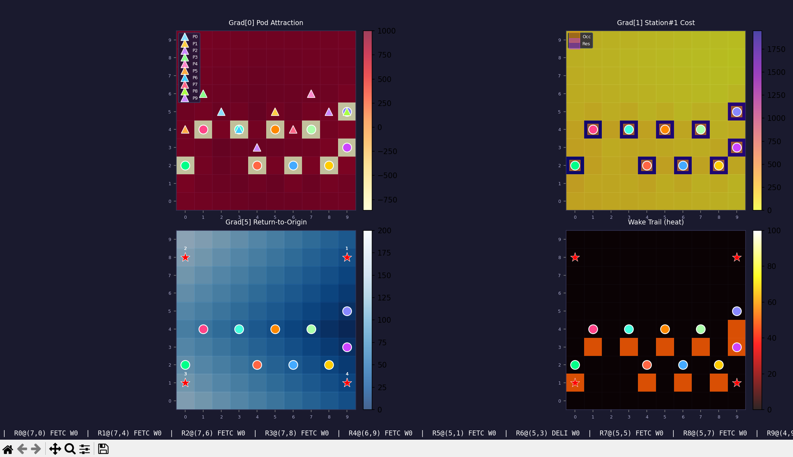
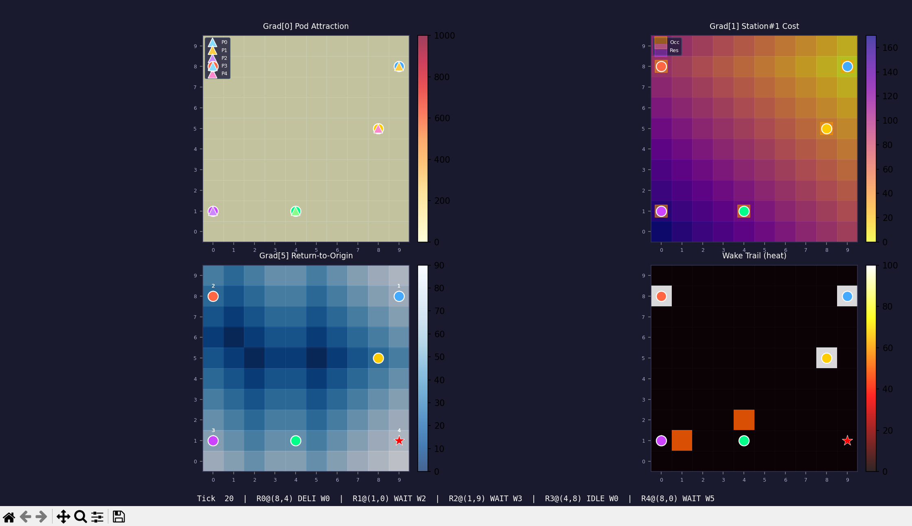
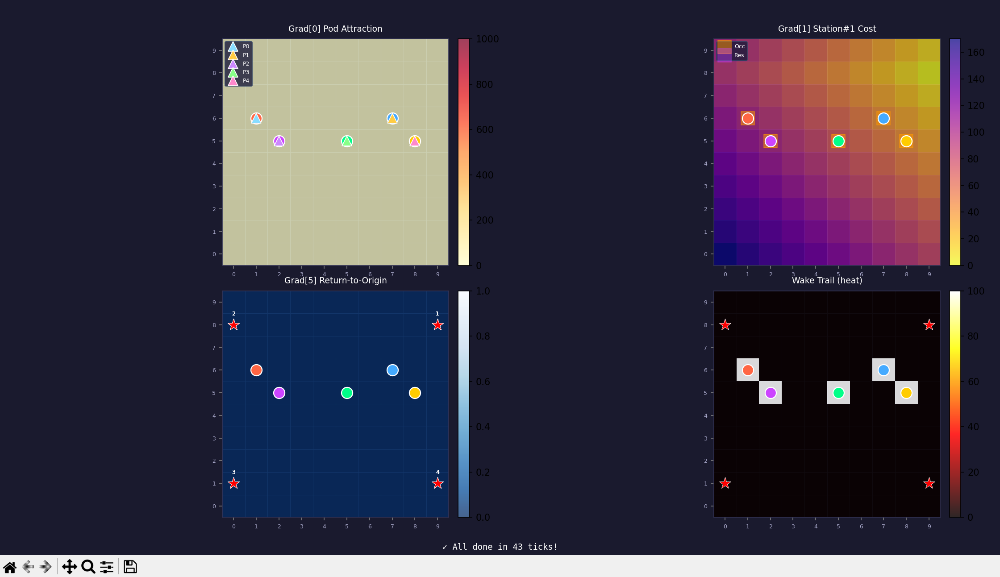
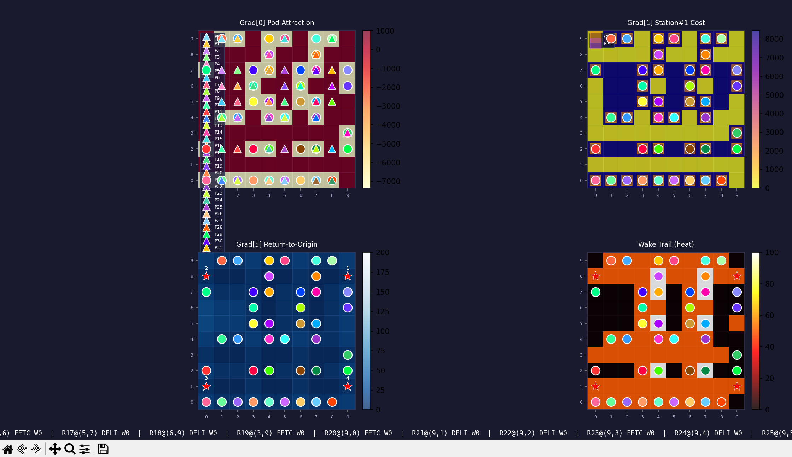
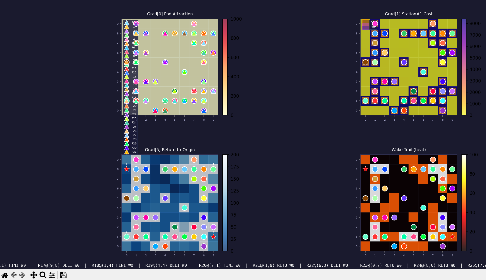
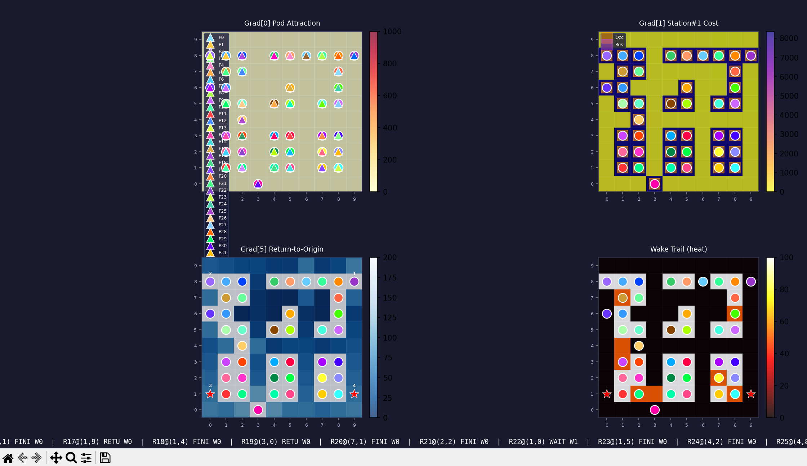
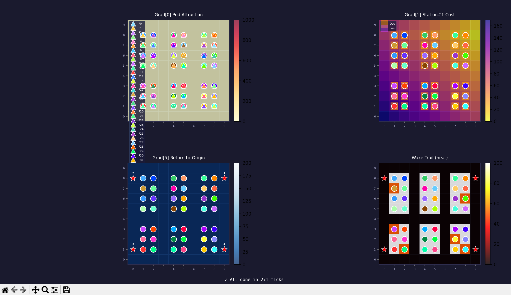

# Pixel-Centrix-Automata

基于梯度场的多机器人仓库导航仿真系统。机器人通过**吸引场**（爬升）和**代价场**（下降）自主导航，完成 Pod 拾取 → 工作站配送 → Pod 归还的全流程。

## 系统架构

```
main.py          入口 & 可视化（matplotlib 实时热力图）
├── simulator.py   仿真调度核心（tick 循环、状态机、防碰撞）
│   ├── injector.py  梯度注入器（场的创建、扩散、清理）
│   ├── robot.py     机器人 Agent（导航决策、移动执行）
│   └── grid.py      地图（Cell 二维数组、扩散算法）
│       └── cell.py    格子 Agent（6 维梯度 + wake 尾迹）
```

## 梯度维度

| 维度 | 名称 | 类型 | 方向 | 用途 |
|------|------|------|------|------|
| `Grad[0]` | Pod 吸引场 | 吸引场 | 爬升（高值=目标） | 多 Pod 峰共用，引导 FETCH_POD 机器人 |
| `Grad[1..4]` | 工作站代价场 | 代价场 | 下降（低值=目标） | 每站独立维度，引导 DELIVER 机器人 |
| `Grad[5]` | 返程代价场 | 代价场 | 下降（低值=目标） | 多返程目标共用，引导 RETURN_POD 机器人 |

## 机器人状态机

```
IDLE → FETCH_POD → DELIVER → WAIT_AT_STATION → RETURN_POD → FINISH
 │         │           │            │                │          │
 │    爬升Grad[0]  下降Grad[K]   等待N tick      下降Grad[5]   终态
 │    拾取任意Pod  送往工作站    工作站处理      归还至任意空槽  不再派发
 └─────────────────────────────────────────────────────────────┘
```

**自由选择机制**：
- **FETCH_POD**：机器人沿 Grad[0] 自由爬升，到达任意未拾取的 Pod 即可拾起
- **RETURN_POD**：机器人沿 Grad[5] 自由下降，到达任意空闲的 Pod 原始格子即可放下

## 核心机制

### 扩散算法

- **吸引场** `diffuse`：`g(t+1) = α·g(t) + (1-α)·max(g_n(t) - δ, 0)`
  - Source 钉在 `MAX_GRAD=1000`，外围衰减，机器人爬升
- **代价场** `diffuse_cost`：`g(t+1) = min(g(t), min_nbr(g_n(t)) + δ)`
  - Source 钉在 `0`，外围递增，机器人下降

### 防碰撞

| 层级 | 范围 | 惩罚值 | 说明 |
|------|------|--------|------|
| Ring 0 | 机器人所在格 | `PENALTY_R0` | 对所有导航中的其他机器人注入 |
| Ring 1 | 曼哈顿距离=1 | `PENALTY_R1` | 仅活跃导航机器人 |
| Ring 2 | 曼哈顿距离=2 | `PENALTY_R2` | 仅活跃导航机器人 |
| Pod 阻碍 | 未拾取 Pod 格 | `PENALTY_R0` | 仅对 DELIVER 机器人生效 |

惩罚方向与导航方向一致：吸引场注入低值（凹坑），代价场注入高值（凸峰）。

### Wake 尾迹（反回溯）

- 机器人进入新格子时设置 `wake = WAKE_INIT`
- 机器人离开后 wake 以 `WAKE_DELTA` 逐 tick 衰减
- 导航评分：`score = grad[dim] ± W2·wake`（爬升减、下降加）
- 效果：抑制机器人原路返回或在局部振荡

### 回程场同步 (`_sync_return_field`)

每 tick 开始时自动将 Grad[5] 同步为当前所有空闲 Pod 槽：
```
free_slots = _all_pod_positions - _occupied_pod_slots
```
消除事件驱动管理中的竞态（同一 tick 内 FETCH 拾起释放新槽 / RETURN 放下占据槽）。

## 可视化

4 面板实时热力图：

| 面板 | 内容 | 色图 |
|------|------|------|
| 左上 | Grad[0] Pod 吸引场 | `RdYlGn` |
| 右上 | Grad[1] Station#1 代价场 | `YlGnBu` |
| 左下 | Grad[5] 返程代价场 | `YlGnBu` |
| 右下 | Wake 尾迹热力图 | `hot` |

标记说明：
- ●（圆点）= 机器人，颜色区分 ID
- ▲（三角）= Pod，颜色区分 ID，搬运时跟随机器人
- ★（红星）= 工作站
- 灰色方块 = 被占据/预约的格子

## 配置参数

| 参数 | 默认值 | 位置 | 说明 |
|------|--------|------|------|
| `ROWS, COLS` | 10, 10 | main.py | 地图大小 |
| `MAX_TICKS` | 500 | main.py | 最大仿真步数 |
| `TICK_INTERVAL` | 0.12s | main.py | 可视化帧间隔 |
| `WAIT_TICKS` | 5 | simulator.py | 工作站等待时间 |
| `MAX_GRAD` | 1000 | injector.py | 吸引场峰值 |
| `ALPHA` | 0.90 | injector.py | 吸引场扩散惯性 |
| `DELTA_DECAY` | 10 | injector.py | 吸引场空间衰减 |
| `WAKE_INIT` | 5.0 | simulator.py | wake 初始值 |
| `WAKE_DELTA` | 1.0 | simulator.py | wake 衰减速率 |
| `W2` | 25.0 | simulator.py | wake 评分权重 |

## 快速开始

```bash
# 激活环境
conda activate "XXX"

# 运行仿真（含可视化）
python main.py
```

当前配置：10 台机器人、10 个 Pod、4 个工作站，约 67 tick 完成所有任务。

## 依赖

- Python 3.10+
- NumPy
- Matplotlib

## DEMO with 20% Nodes





## DEMO with 84% Nodes



